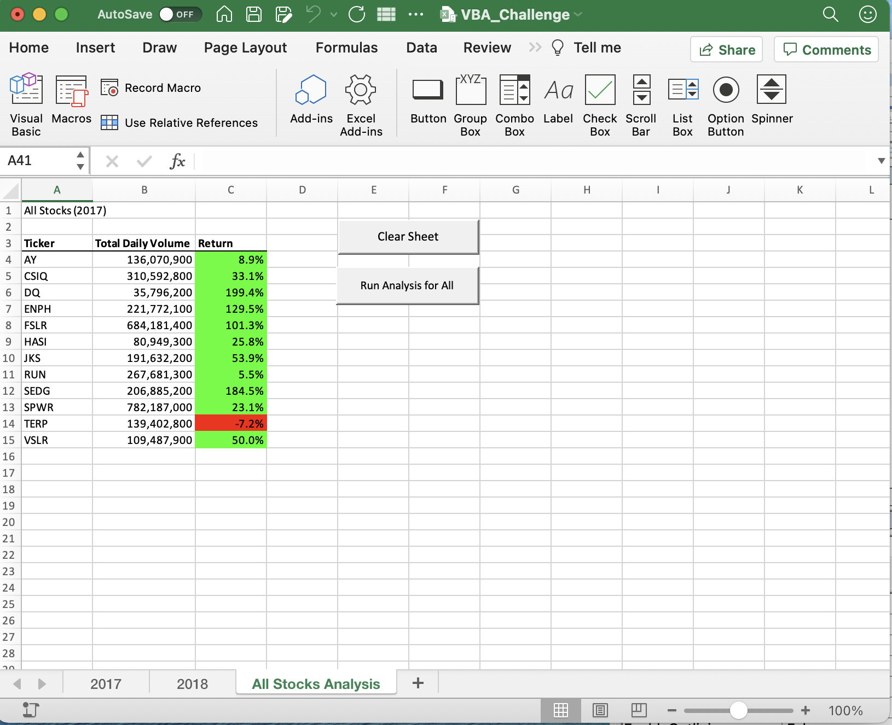
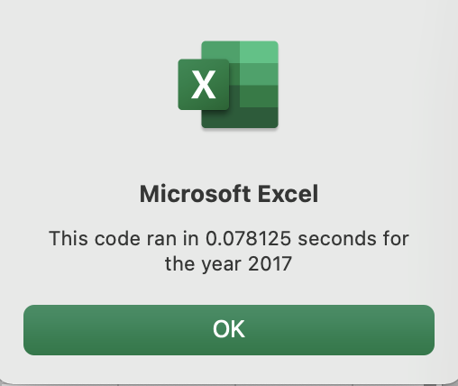
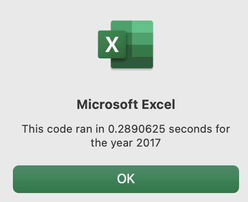
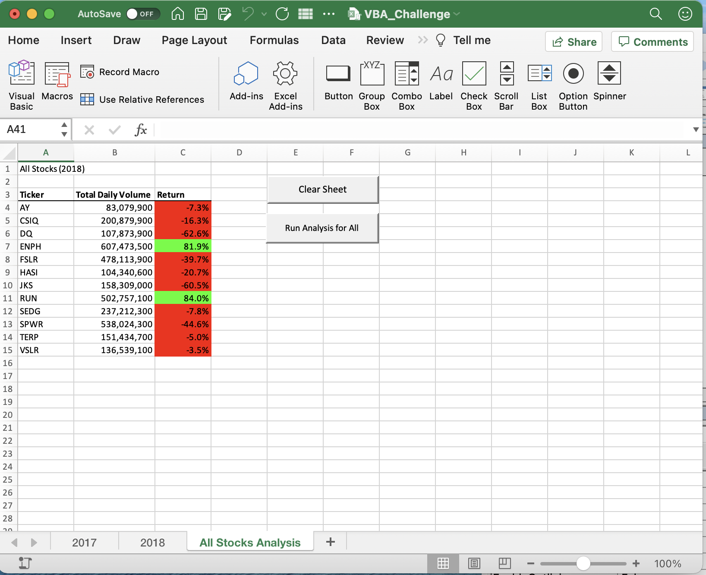
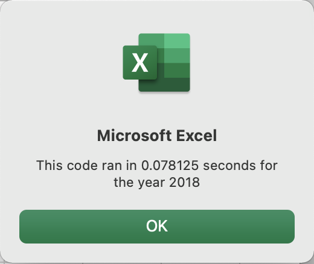
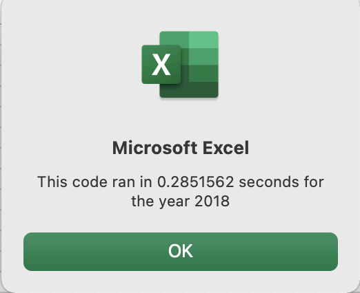
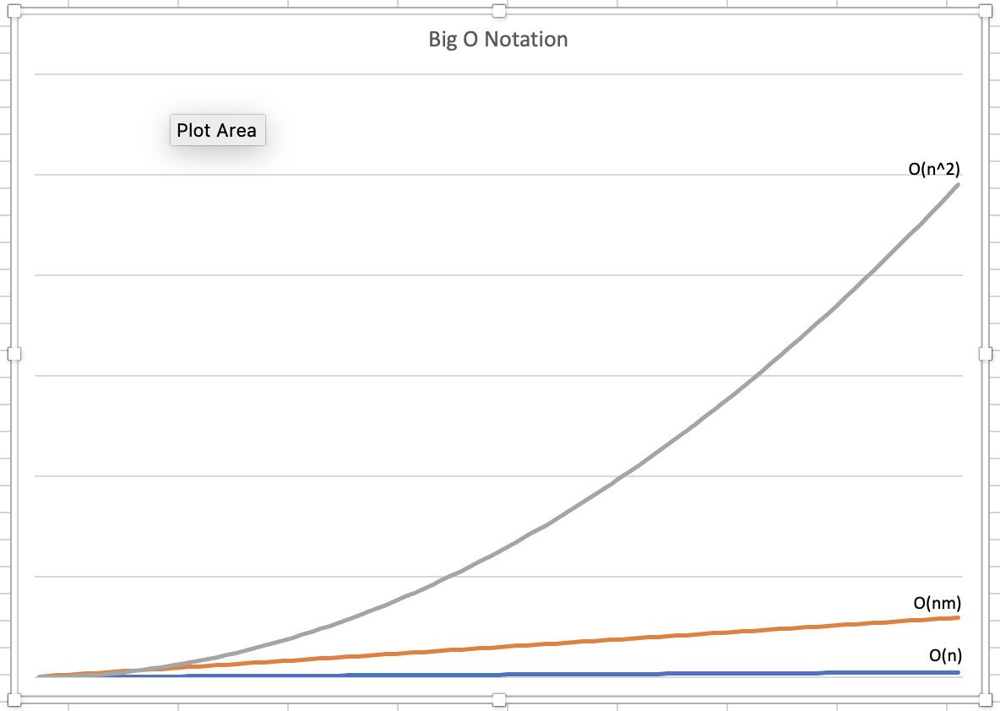

# VBA Refactoring Challenge
## Overview of Project
### Purpose
The purpose of this project is to gain insight into how refactoring code can affect the run time of code particularly when there are many lines of data to analyze.  
### Background
The challenge uses this <a href="VBA_Challenge.xlsm">dataset</a> to analyze the yearly data of twelve different stocks and output, for each stock, its ticker symbol, total volume and return for that year.  Because this dataset only uses 12 stocks the idea behind this project is to determine if it's possible to reduce the runtime so that if 100's or thousands of stocks were analyzed the execution time is shortened.

The columns of the input sheet represent the information for each stock.  They are **Ticker, Date, Open, High, Low, Close, Adj Close, Volume**. The rows of data represents each day of the year the stock market was open.  For our analysis we are looking at data from **2017 and 2018**. 

An initial project called Green Stocks was used as the basis for this challenge project.  In the initial project the code used *two for loops*, one inside another.  The inner loop checked if the stock ticker was changing to the next ticker, or if it had just changed to a new ticker.  This made it possible to add up the total volume and get the starting and ending prices. The outer loop iterated over the 12 ticker symbols.  So as a ticker symbol changed the inner loop restarted at the top of the sheet searching for the ticker symbol and determining if it was at the start date or end date for that ticker for that year.  In the outer loop, prior to going to the next ticker the information collected was output to the **All Stocks Analysis** sheet in the **Ticker, Total Daily Volume, and Return** columns.  The return is the the starting price divided by the ending price minus 1.

This challenge was designed to see if refactoring the initial projects code and use *one for loop* instead of two would make a difference in the run time.  To do this arrays are used for total volume, starting price and ending price. This makes it possible to run one loop from the top of the sheet to the bottom one time.  Each array uses a variable called tickerIndex to keep track of which ticker symbol the code is collecting data for.  The code to check if the next ticker symbol is different than the current ticker symbol is still incoporated in the refactored code but instead of having to drop out of the loop to increment to the next symbol the tickerIndex is incremented by 1.

# Results
The results of the output sheet, that is the calculations for volume and return for the challange is the same as the initial project and is expected.  The real results that we are interested in for this challenge is the output times.

### Results for 2017 sheet
This is the output sheet for the data from the 2017 sheet:
   

And the output times for 2017 for both the refactored code in the VBA Challenge and the Green Stocks code with the two loops:

|VBA Challenge Output Time for 2017|Green Stocks Output Time for 2017|
|---|---|
| | |

### Results for 2018 sheet
This is the output sheet for the data from the 2018 sheet:

   

And the output times for 2018 for both the refactored code in the VBA Challenge and the Green Stocks code with the two loops:

|VBA Challenge Output Time for 2018|Green Stocks Output Time for 2018|
|---|---|
| | |

### Analysis of Data
As seen above the refactored code does run faster then the original code.  While the actual data collected and shown on the **All Stocks Analysis** sheet is different for 2017 and 2018 the time of execution was quite similar.  

For 2017 the refactored code ran in .078125 seconds and the original Green Stocks code with two loops ran in .2890625 seconds.  A difference of .2109375 seconds.  

Similarly the 2018 sheet finished in .078125 seconds.  Where the original Green Stocks code for 2018 ran in slightly less time then 2017 at .2851562.

The difference of about .2 seconds between the original and refactored VBA code shows therefore that by running one loop vs. two loops execution time was improved.

## Summary
The point of this challenge was to determine if refactoring code can help improve the runtime or execution time of the code.  Lets consider a few of the advantages and disadvantages for doing this in general and in the context of this challenge.

### Advantages in General
The advantages of refactoring code is that it can be made to run faster.  One way to understand this better is through <a href="https://en.wikipedia.org/wiki/Big_O_notation">Big O notation.</a> In simplistic terms Big O notation is used to indicate the time complexity of the given code.  

For example a spreadsheet has 3000 rows of data and the code goes through each row and adds one of the columns up to find the total.  In Big O notation O(n) n is the number of rows and this would be linear time.  The n is the number of rows in our example and seen in the graphic on the blue line. The grey line represents quadratic time and when a loop is run inside a loop where both loops run for the same number of times you can see that the time it takes to run increases much more rapidly.  Finally there is a place in the middle where the outer and inner loops are of differing numbers and that is the orange line.  Greater then linear time but not at great as quadratic time. Thus code that runs one loop will be faster then one that has to run two loops.

  
 
### Advantages in the Challenge refactored VBA Script
The advantages of refactoring the original code was an decrease in the amount of time it took to run the code. Before even running the refactored code we were assured that the code would be faster by looking at the Big O notation graph.  
 
### Disadvantages in General
The disadvantages in refactoring code can be memory use and code complexity. When information that is being calculated it needs to be stored somewhere.  This is in the RAM of the computer.  While the code is executing it is possible to sense the time it's taking but we can't sense how much RAM it's using.  Eventually if the computer is asked to store more information then it has memory to store the program will crash.  Therefore one disadvantage of refactoring might be in creating a program that is limited to only a certain amount of code based on the size of the RAM in the machine.  
 
Another disadvantage is code complexity.  If the code is using lots of variables to store information being collected it may be difficult for another programmer to understand what the code is doing and how it's doing it.  For example if the code has to go through two loops a programmer would see the first loop with it's starting For i = 1 to someNumber and then see the second loop For j = 1 to another number.  Following the iterations and the code in the middle of the loops can be easier to understand in some cases vs, trying to see which array is getting what information.  Of course good comments can help to eliminate this as a problem and disadvantage.

### Final thoughts and notes
